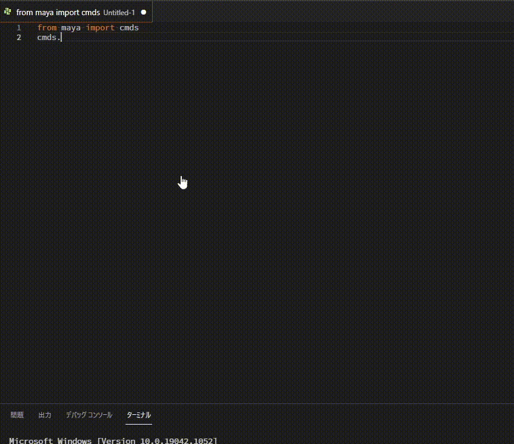
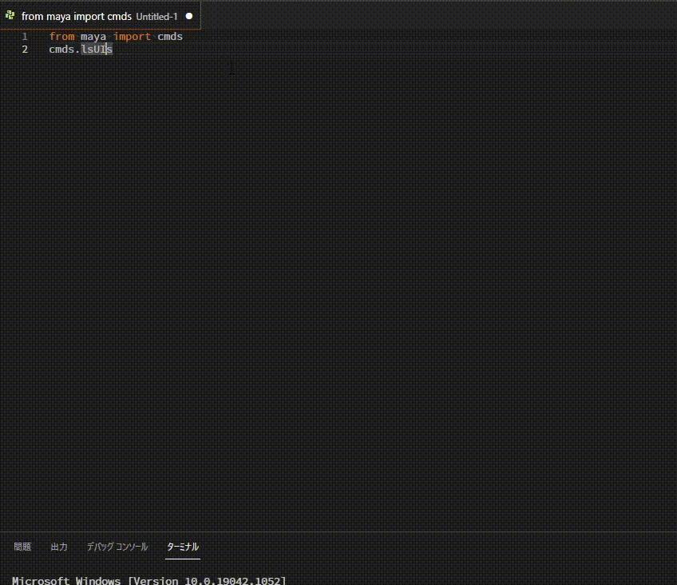
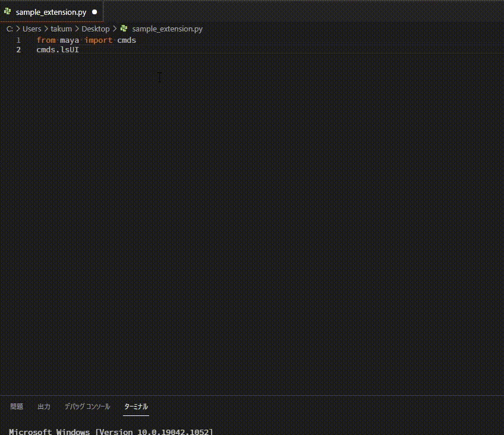

# MayaQuickDocument
[Japanese version](./README_jp.md)

MayaQuickDocument is an extension that makes it easy to open code documents while coding in VSCode.

## Features
You can use the browser to display the command at the cursor position, or use the  
>   

Display the command document for the selected word.  
>   

It can be run from the menu, but by default it can be run with `Ctrl+;`.  
>   

## Extension Settings

This extension provides the following settings.

* `maya-quick-document.target-language`: Sets the language in which the document will be displayed. The default is "JPN". ENU" and "CHS" can be set.
* `maya-quick-document.use-maya-version`: Specify the Maya version. Default is "2018".

## Known Issues

We have not confirmed the operation on non-Windows systems.  
This may cause problems such as the browser not being able to start.  
(If you can, please report any problems.)

## Release Notes

### 0.0.1
Initial release

### 0.0.2
Fixed because it was Mel URL.
