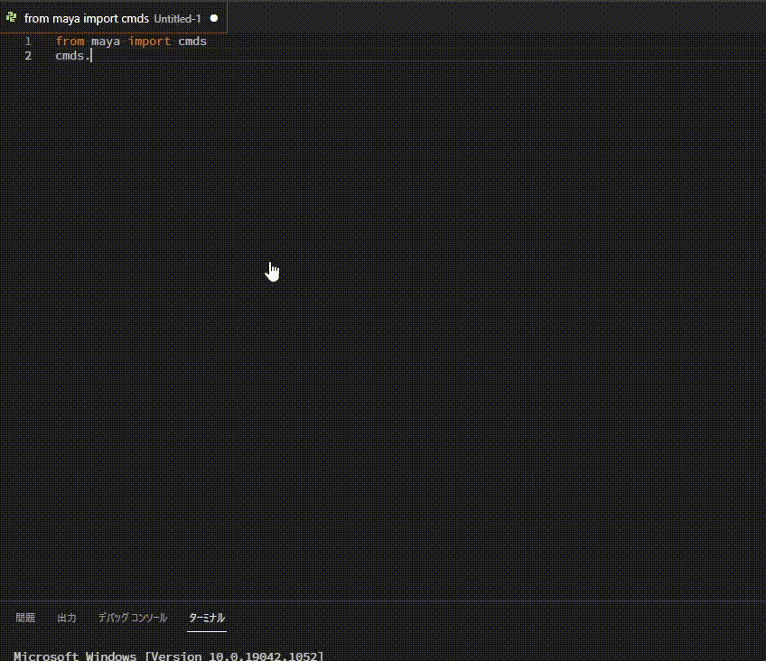
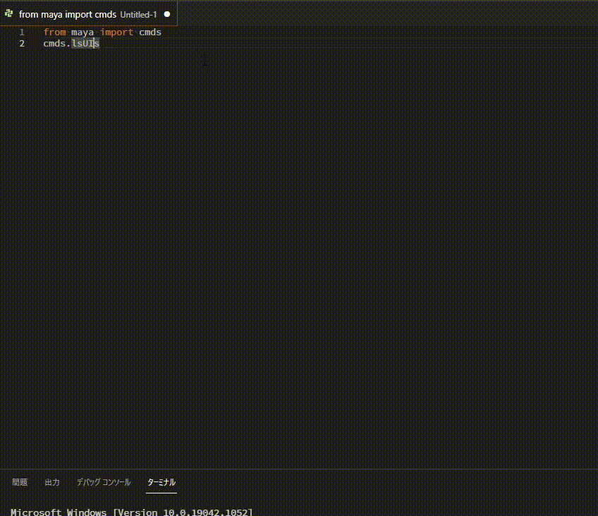
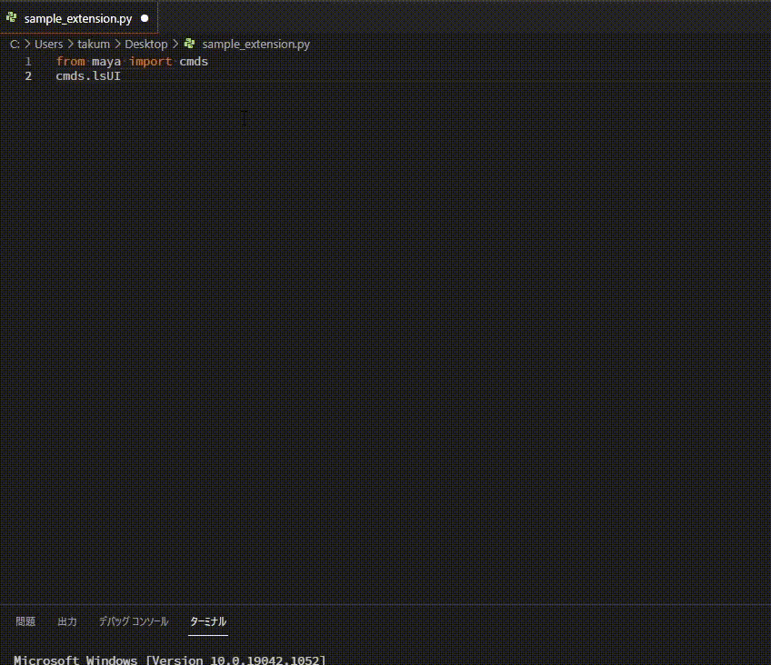

# MayaQuickDocument
MayaQuickDocumentは、VSCodeでのコーディング中にコードドキュメントを簡単に開くことができる拡張機能です。

## 機能
カーソル位置のコマンドをbrowserで表示したり、
>   

選択範囲のワードに該当するコマンドDocumentを表示したりできます。
>   

メニューから実行できますが、デフォルトでは`Ctrl+;`で実行可能です。  
(日本語配列の場合は`Ctrl+:`で実行可能)  
>   

`open-type`を「webview」にするとVSCode内のWebViewで表示します。  
>   

## 拡張機能の設定
この拡張機能は以下の設定を提供します。

* `maya-quick-document.target-language`: ドキュメントを表示する言語を設定します。デフォルトは「JPN」。「ENU」と「CHS」が設定可能です。
* `maya-quick-document.use-maya-version`: Mayaバージョンを指定します。デフォルトは「2018」です。
* `maya-quick-document.open-type`: 開くモードを選択します。デフォルトは「browser」。
  * 「browser」は既存のWebBrowserで開き、「webview」だとvscode内のWebViewで開きます。

## 既知の問題
Windows以外では動作確認ができていません。  
ブラウザーが起動できないなどの問題が発生する可能性があります。
(もし、可能であれば問題がある場合、ご報告ください。)

## リリースノート

### 0.0.1
初回リリース

### 0.0.2
MelURLだった為修正

### 0.0.3
WebViewモードを追加